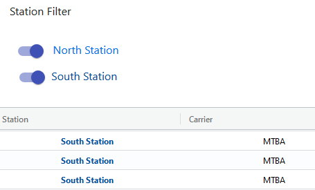
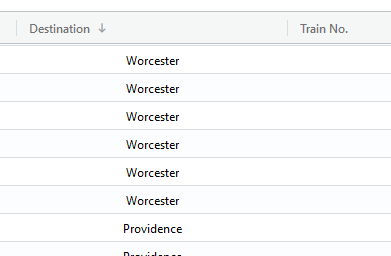
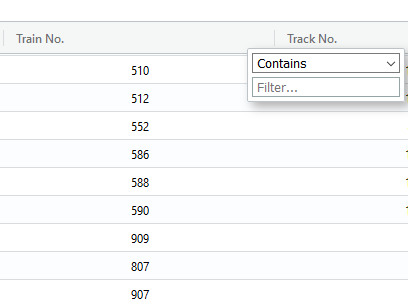
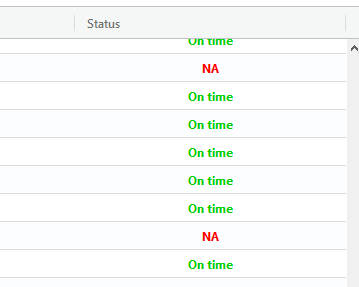

# MBTA North Station and South Station Project

This project was created using create-react-app and uses Materials-UI and AG-Grid. The goal is to pull departure data from the MBTA for the commuter rail lines leaving from North and South Stations.

Live Demo: https://td3-mbta-schedule.now.sh/

Data is pulled from MBTA V3 API: https://www.mbta.com/developers/v3-api
 

## Useful tips

The app can be set to display data for one station or a combination of both by adjusting the station filter.

&nbsp;&nbsp;&nbsp;&nbsp;

Results can be sorted (ascending or descending) by specific columns by clicking on the header.

&nbsp;&nbsp;&nbsp;&nbsp;
 
Results can be filtered by specific columns by setting a filter on the header.

&nbsp;&nbsp;&nbsp;&nbsp;

The potential issues with a routes status (i.e. - late, delayed, canceled, etc...) are highlighted in red.

&nbsp;&nbsp;&nbsp;&nbsp;

Key Technologies:
MBTA V3 API,
React,
CSS,
Materials-UI,
AG-Grid
